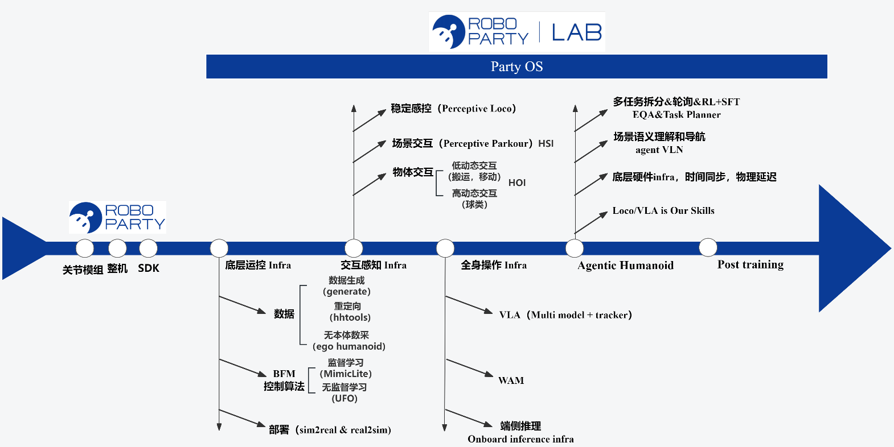

# Party OS

**ROBO PARTY | LAB** 面向人形机器人的系统与能力演进路线。

Party OS 串联数据采集与生成、动作重定向、模仿学习与无监督学习，并逐步扩展到人–物交互（HOI）与人–系统交互（HSI），VLA，Agentic Humanoid，形成从底层工具到上层交互能力的完整栈。

## Roadmap

  

## 子项目

按 Roadmap 从底层能力到上层交互展开：

<table>
  <thead>
    <tr>
      <th>层级</th>
      <th>模块</th>
      <th>说明</th>
      <th>仓库</th>
    </tr>
  </thead>
  <tbody>
    <tr>
      <td><strong>Know-how 文档</strong></td>
      <td>知识库</td>
      <td>ROBO PARTY 技术 Know-how 与文档汇总</td>
      <td><a href="https://roboparty.feishu.cn/wiki/GvUxwKVeNiGa7kku6vEcvqfKn87">《人形机器人运动控制Know-how》</a></td>
    </tr>
    <tr>
      <td rowspan="4"><strong>底层运控 Infra</strong></td>
      <td>数据生成 (generate)</td>
      <td>数据生成</td>
      <td>即将开源</td>
    </tr>
    <tr>
      <td>重定向 (hhtools)</td>
      <td>人体 / 机器人动作到任意人形的快速重定向</td>
      <td><a href="https://github.com/Roboparty/human-humanoid-tools">Roboparty/human-humanoid-tools</a></td>
    </tr>
    <tr>
      <td>监督学习 (MimicLite)</td>
      <td>运动模仿：加载、跟踪、训练、评估与部署衔接</td>
      <td><a href="https://github.com/Roboparty/MimicLite">Roboparty/MimicLite</a></td>
    </tr>
    <tr>
      <td>无监督学习 (UFO)</td>
      <td>无监督学习框架</td>
      <td><a href="https://github.com/Roboparty/UFO">Roboparty/UFO</a></td>
    </tr>
  </tbody>
</table>

## 许可证

本仓库采用 [GNU General Public License v3.0 (GPL-3.0)](LICENSE)。各子项目保留各自的许可证，使用前请查阅对应仓库说明。
